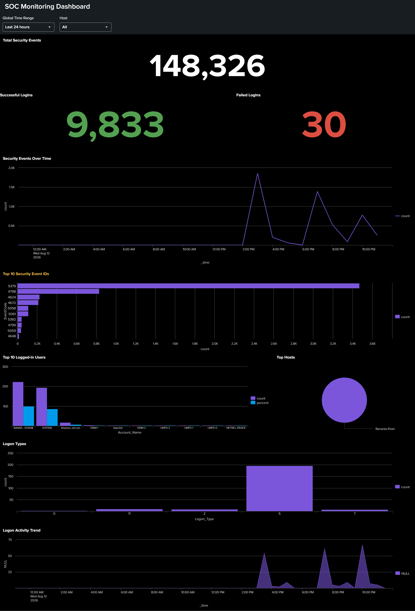

Markdown


# 🛡️ Splunk Windows Security Operations Center (SOC) Dashboard

An interactive Security Information and Event Management (SIEM) dashboard built in **Splunk Enterprise (Dashboard Studio)** to monitor, analyze, and visualize Windows Security Event Logs in real-time.

---

## 📊 Dashboard Preview



---

## 📌 Project Overview

This project demonstrates a **Tier-1 SOC Analyst workflow** focused on monitoring system logons, user authentication patterns, and security-relevant Windows event activity. By ingesting and analyzing Windows Security Event Logs, this dashboard provides high-level single-value threat KPIs, time-series anomaly detection, and categorical event breakdowns to streamline threat detection and triage.

---

## 🎯 Key Metrics & Visualizations

* **Total Security Events KPI**: Single-value metric tracking overall log ingestion (**148,222 Total Security Events** monitored).
* **Authentication Indicators**: Real-time visibility into **Successful Logins (9,833)** and **Failed Logins (30)** for tracking authentication anomalies.
* **Security Events Over Time**: Time-series line chart identifying volume peaks and potential spikes in security activity.
* **Top 10 Security Event IDs**: Horizontal bar chart highlighting high-frequency Windows Event Codes, including:
  * `5379` (User Account Credentials Read)
  * `4798` (User Local Group Membership Enumerated)
  * `4624` (Successful Logon)
  * `4672` (Special Privileges Assigned)
  * `5058` / `5061` (Cryptographic Operations)
* **Top Logged-in Users & Hosts**: Bar and pie chart distributions tracking active identities (`SYSTEM`, local user accounts) and target host systems (`Banaras-Khan`).
* **Logon Types Analysis**: Categorical breakdown of authentication vectors (e.g., `Logon_Type 5` for Service Accounts, `Logon_Type 2` for Interactive Logons).
* **Logon Activity Trend**: Timechart tracking successful logon frequency across active user accounts over time.

---

## 🔍 Key SPL (Search Processing Language) Queries Used

### 1. Total Security Events Counter
```spl
index=* EventCode=* | stats count
2. Successful vs. Failed Logins Count
Splunk SPL
# Successful Logins
index=* EventCode=4624 | stats count

# Failed Logins
index=* EventCode=4625 | stats count
3. Top 10 Security Event IDs Breakdown
Splunk SPL
index=* EventCode=* | top limit=10 EventCode
4. Logon Types Distribution
Splunk SPL
index=* EventCode=4624 | stats count by Logon_Type
5. Logon Activity Trend Over Time
Splunk SPL
index=* EventCode=4624 | timechart count by TargetUserName
📂 Repository Structure
Plaintext
Splunk-SOC-Monitoring-Dashboard/
│
├── dashboards/
│   └── soc_monitoring_dashboard.json # Splunk Dashboard Studio source code (JSON)
├── queries/
│   └── spl_queries.spl               # List of SPL queries used in the dashboard
├── docs/
│   └── dashboard_preview.png         # Screenshot of the dashboard
└── README.md                         # Project documentation
🚀 How to Import into Splunk
Open your Splunk Enterprise instance.

Navigate to Dashboards ➔ Click Create New Dashboard.

Select Dashboard Studio as the layout option.

In the top toolbar, click on Source Code ({}).

Copy the JSON code from dashboards/soc_monitoring_dashboard.json and paste it into the editor.

Click Save to launch your interactive SOC dashboard!

👤 Author & Contact
Banaras Khan

Aspiring Cybersecurity Analyst / Blue Team Specialist

Education: BS Computer Science, Iqra University

LinkedIn: linkedin.com/in/banaras-khan-8a9300326

Email: kbanaras6666@gmail.com

GitHub: github.com/Banaraskhan111

⚖️ Disclaimer
This dashboard was developed inside a controlled laboratory environment utilizing simulated Windows Security Event Logs for educational and threat-monitoring demonstration purposes.
